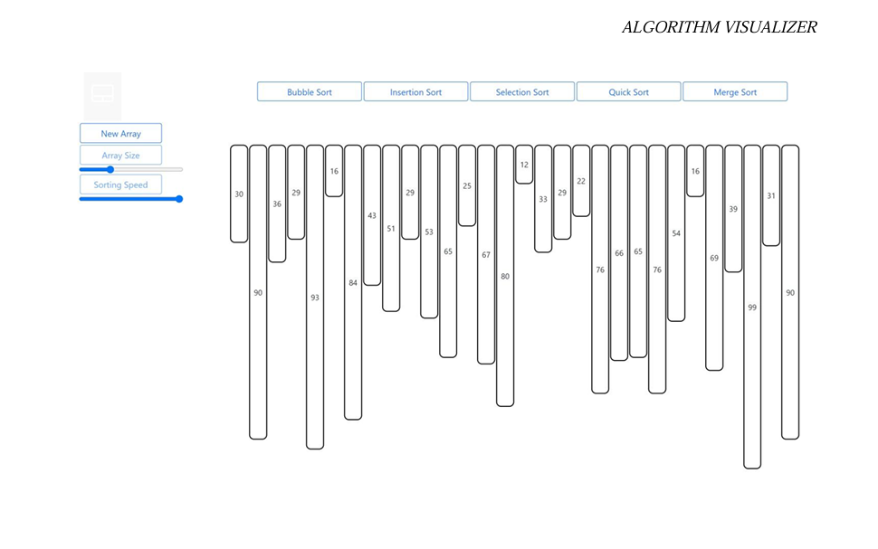
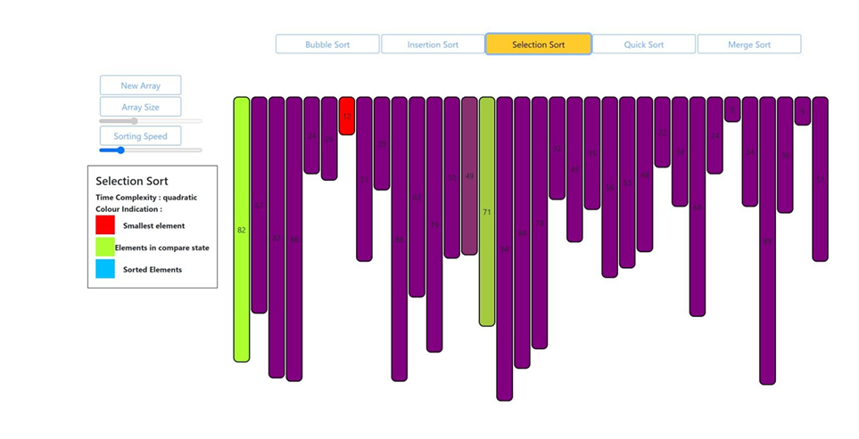
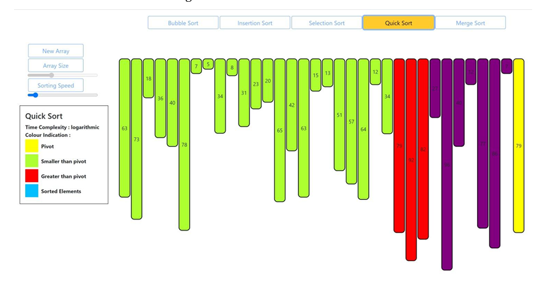

# Algorithm Visualizer

An interactive web-based platform designed to visualize the flow and operation of various data structures and algorithms. This tool serves as a comprehensive resource for educators and students to teach and learn computer science concepts effectively.

## Abstract
Algorithms and data structures are essential parts of computer science. Standard teaching methods using whiteboards or slides can sometimes be limited in explaining dynamic processes. This **Algorithm Visualizer** addresses this by providing an interactive environment where users can see algorithms in action. It focuses on attracting students' attention, explaining concepts in visual terms, and encouraging a practical learning process through real-time interaction.

## Key Features
* **Interactive Visualization:** Watch how algorithms step through data in real-time.
* **Educational Tool:** Designed to facilitate better communication between students and instructors.
* **User-Friendly Interface:** Built using modern web technologies for a smooth experience.
* **Comprehensive Learning:** Helps in understanding complex logic through visual representation.

## Tech Stack
* **Frontend:** HTML5, CSS3 (for UI and animations)
* **Logic:** JavaScript (ES6+) for algorithm implementation
* **Documentation:** Comprehensive project report included in the repository.

## Project Structure
## Project Structure

The project follows a modular directory structure to keep the logic, styling, and assets organized:

* **`index.html`** - The primary entry point of the visualizer.
* **`js/`** - Contains all JavaScript logic and frameworks:
    * **`bootstrap/`** - Includes Bootstrap CSS and JS framework files for a responsive UI.
    * **`utility/`** - Contains core helper scripts:
        * `index.js` - Main entry for utility functions.
        * **`sortingOptions/`** - Individual sorting logic files (Bubble, Insertion, Merge, Quick, Selection).
    * `sorting.js` - The main controller script for the visualization logic.
* **`styles/`** - Contains custom styling:
    * **`css/`** - Additional CSS components and libraries.
    * `style.css` - Main stylesheet for the project layout and animations.
* **`image/`** - Stores project screenshots and the output demonstration video.
* **`Algorithm Visualizer document.pdf`** - Comprehensive project documentation and report.
*

## How to Run
1.  Download or clone this repository to your local machine.
2.  Navigate to the project folder.
3.  Open `index.html` in any web browser (Chrome, Firefox, or Edge).
4.  Interact with the UI to start the visualizations.

## Screenshots & Demo
## Screenshots & Demo

### 1. Main Interface

### 2. Sorting in Progress

### 3. Final Sorted Result

### 4. Project Video
[Click here to view the Output Video](images/Output.mp4)
## Project Demo
Watch the Algorithm Visualizer in action:

[Click here to view the Output Video](images/Output.mp4)

---
*Developed as part of academic project work at Dept of CS, NG.*
